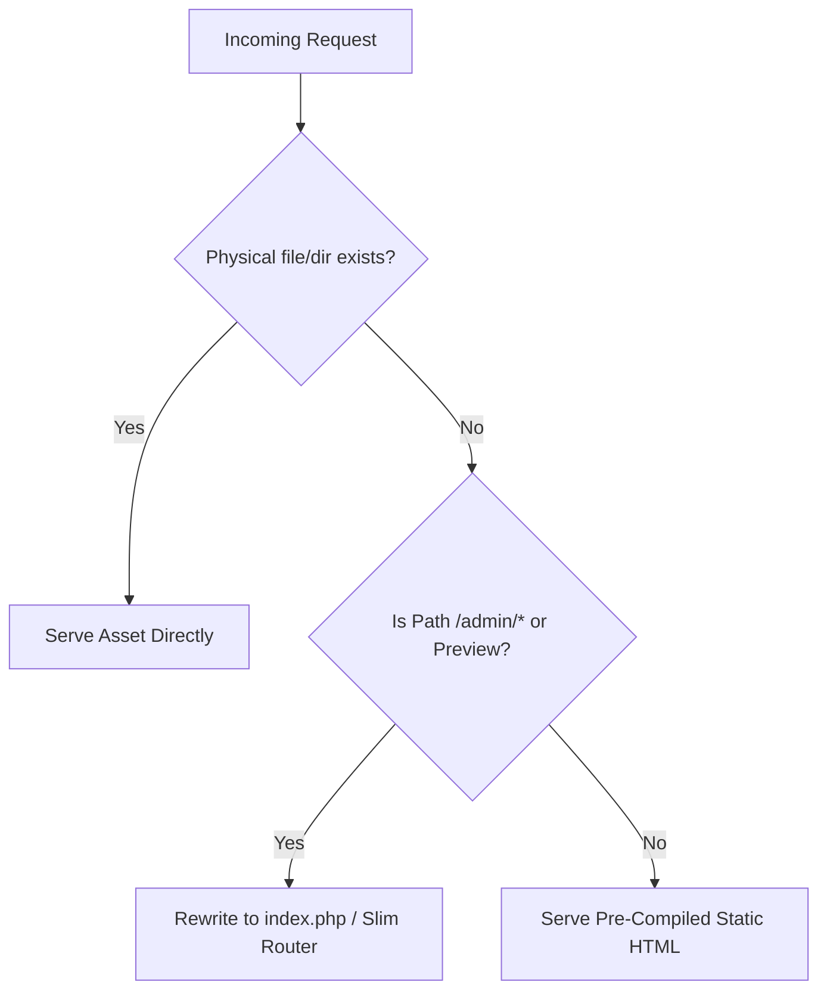

# FablePress.io: Project Architecture & Operations Summary

FablePress.io is a simplified, distraction-free Content Management System (CMS) designed for independent writers, creators, and small brands. It merges the user-friendly publishing workflow of a dynamic database-backed admin panel with the raw performance, security, and low hosting overhead of a pre-compiled static website.

---

## 🏗️ Jekyll-Hybrid Architecture

FablePress.io utilizes a decoupled **Jekyll-Hybrid** (Dynamic Admin, Static Public) architecture. This approach separates content administration from content delivery:

```mermaid
graph TD
    subgraph "Dynamic Admin Environment (PHP + SQLite/MySQL)"
        Admin[Admin Dashboard /admin/] -->|Write Content / Manage Settings| DB[(Database: SQLite / MySQL)]
        Admin -->|Triggers Rebuild| SG["app/Services/StaticGenerator.php"]
    end

    subgraph "Static Generation Pipeline"
        SG -->|Reads Content| DB
        SG -->|Compiles Page Templates| Output[Static HTML Files]
    end

    subgraph "Static Public Site (High Performance / Zero DB)"
        Visitor[Visitor Browser] -->|Clean URL Request| WebServer[Apache / Local Server]
        WebServer -->|Serves instantly| Output
        Output -->|Homepage| P1[index.html]
        Output -->|Catalog| P2[stories/index.html]
        Output -->|Pages / Stories| P3[/{slug}/index.html]
    end
```

### 1. Dynamic Admin Panel (Backend)
* **Technology Stack**: PHP 8.x + SQLite (local development) or MySQL (production).
* **Core Functions**: Handles password-protected authentication, session management, media uploads to `/assets/uploads`, navigation menu configuration, role privilege definition, and story/page drafting.
* **Database Access**: Active only during admin operations, author logins, content updates, or migrations.

### 2. Static Public Site (Frontend)
* **Technology Stack**: Pre-compiled static HTML, CSS stylesheets, and client-side assets.
* **Core Concept**: Every time a post/page is published, updated, or deleted, or when the navigation structure changes, the application compiles the templates to flat HTML.
* **No Database Overhead**: Live visitors load raw, pre-built static files directly. There are no runtime SQL queries executed on public visits.
* **Benefits**:
  * **Sub-50ms page load times**.
  * **Zero SQL-injection surface area** on the public frontend.
  * **Minimal hosting requirements**, capable of handling viral spikes on minimal hardware.

---

## 🚦 Routing Architecture & Clean URLs

To preserve clean directories and provide an elegant writing workspace, FablePress handles routing differently depending on whether physical files exist.



### 1. Local Development (`router.php`)
When running PHP's built-in web server via `php -S localhost:8000 router.php`, requests are filtered as follows:
* **Physical Assets**: If the request path points to an actual file or directory inside `public/` (e.g. CSS, images, static `.html` files), the router serves it directly.
* **Virtual Paths**: All dynamic requests (such as admin login, editor pages, or unpublished preview pages) are forwarded directly to the Slim 4 app inside `public/index.php`.

### 2. Production Apache Server (`public/.htaccess`)
On shared hosting, Apache executes URL rewriting rules inside the `public/` document root to mimic this behavior:
```apache
RewriteEngine On
RewriteBase /

# Exclude existing physical files and directories from rewrite rules
RewriteCond %{REQUEST_FILENAME} -f [OR]
RewriteCond %{REQUEST_FILENAME} -d
RewriteRule ^ - [L]

# Route all other traffic to the Slim front-controller index.php
RewriteRule ^ index.php [QSA,L]
```

### 3. Slim 4 Front Controller (`public/index.php`)
For all non-physical endpoints, the Slim 4 app intercepts requests:
* **Trailing Slashes**: Middleware automatically normalizes directory-like requests to end with a trailing slash via a `301 Redirect` (e.g. `/admin` redirects to `/admin/`).
* **Admin Group Routing**: Handles login, dashboard stats, roles, navigation configuration, and story drafting/editing actions.
* **Dynamic Post Routing**: The catch-all route `/{slug}/` dynamically queries the database to display a draft or preview version of a page before it is officially compiled to static HTML.

---

## ⚙️ Static Site Compiler (`app/Services/StaticGenerator.php`)

The class `StaticGenerator` contains the compilation engine that builds the static public distribution. 

### 1. Core Functions
* **`generateAll()`**: Performs the primary generation workflow:
  1. **Public Homepage**: Compiles the template at `templates/home.php` and writes it to `public/index.html`.
  2. **Stories Catalog**: Verifies the `public/stories` folder exists, compiles `templates/stories.php`, and writes it to `public/stories/index.html`.
  3. **Individual Stories & Pages**: Selects all posts with a status of `published`. If the category is 'stories', it compiles it to `public/stories/{slug}/index.html`. Otherwise, it compiles it to `public/{slug}/index.html`.
  4. **Stale Folder Cleanup**: Scans the `public/` and `public/stories/` directories and identifies any subdirectories that do *not* match active published slugs for pages and stories. It purges these directories to avoid stale content.
* **`renderTemplate($templatePath, $slug = null)`**: Renders a template safely using output buffering (`ob_start()`, `ob_get_clean()`). To prevent scope pollution or variable collisions within the generator, the template is evaluated inside a self-invoking closure. If a `$slug` is supplied, it is temporarily injected into `$_GET['slug']` to mimic a dynamic request context.
* **`deleteDirectory($dir)`**: Recursively deletes directories and files to perform cleanup of removed pages.

### 2. Rebuilding Hooks
`StaticGenerator::generateAll()` is tied to key admin database events. It is triggered instantly when:
* A story/page is published, edited, or deleted (`public/admin/Controllers/story-edit.php` and `public/admin/Controllers/stories.php`).
* The navigation menu links are re-ordered or modified (`public/admin/Controllers/navigation.php`).

---

## 🚀 Hostinger Shared Hosting Deployment

Deploying FablePress.io to Hostinger Business Shared Hosting requires adapting to the lack of post-deployment compilation commands.

### Path A: Pre-Compiling and Committing Dependencies
Because Hostinger does not run automated Composer post-install scripts on git pulls, you must commit vendor dependencies directly to git:
1. Run `composer install --no-dev --optimize-autoloader` locally to ensure dependencies are fully optimized.
2. Commit the `vendor/` folder to git so that dependencies (including the Slim framework codebase) are ready to load immediately on production checkout.

### Production Environment Isolation (`.env`)
Database configuration is kept environment-agnostic via `.env`. In `app/Config/config.php`, environment variables are parsed and mapped to constants. 

To set up production:
1. Create a `.env` file in the root directory on the Hostinger server.
2. Enter the production credentials (configured through hPanel):
   ```env
   # FablePress Environment Configuration
   DB_MODE=mysql

   # MySQL Database Configuration (Hostinger hPanel)
   DB_HOST=127.0.0.1
   DB_NAME=u123456789_fablepress
   DB_USER=u123456789_admin
   DB_PASS=YourSecureProductionPasswordHere
   ```
3. Secure the `.env` file by verifying your server block configuration doesn't expose environment files publicly.

---

## 🔄 SQLite-to-MySQL Database Migration

When transitioning from local SQLite development to production MySQL databases, FablePress provides a specialized script: `/migrate.php`.

### 1. Migration Steps
1. **Prepare MySQL**: Create the MySQL database and user on Hostinger hPanel.
2. **Setup Server `.env`**: Upload the `.env` file containing the MySQL credentials and `DB_MODE=mysql`.
3. **Upload Local DB**: Copy the local SQLite database file `app/Database/fablepress.db` into the `app/Database/` folder of the Hostinger server via FTP or hPanel File Manager.
4. **Run Script**: In your browser, navigate to `https://yourdomain.com/migrate.php`.
5. **Execute**: Verify that the script correctly detects the uploaded `app/Database/fablepress.db` file and target MySQL settings, then click **Start MySQL Migration**.
6. **Data Transfer Process**:
   * Temporarily disables foreign key checks (`SET FOREIGN_KEY_CHECKS = 0`).
   * Wipes target MySQL tables (`TRUNCATE TABLE`).
   * Iterates through tables (`users`, `posts`, `media`, `navigation`, `role_permissions`), copying records from SQLite to MySQL.
   * Re-enables foreign key checks (`SET FOREIGN_KEY_CHECKS = 1`).
   * Automatically deletes the source SQLite file `app/Database/fablepress.db` upon successful completion.

### 2. ⚠️ Critical Security Precautions
> [!CAUTION]
> **OVERWRITE WARNING**: Executing this migration will completely erase any existing data in the target MySQL tables. Ensure you have backed up any production data before migrating.

> [!WARNING]
> **MANUAL CLEANUP REQUIRED**: Although the script automatically deletes the SQLite source file (`app/Database/fablepress.db`), it **CANNOT** delete itself. You **must manually delete `migrate.php`** from the Hostinger server immediately after use. Keeping the script on a live site leaves your database vulnerable to unauthorized wipes or data exposure.

---

## 🔑 Authentication & Role-Based Access Control (RBAC)

FablePress enforces granular RBAC permissions. User roles are defined during installation, and permissions can be verified dynamically using `has_permission($role, $permission_key)`.

### 1. Default Access Credentials
To test different privilege levels, authenticate using the default seeded accounts:

| Username | Default Password | Role | Access Level | Description |
| :--- | :--- | :--- | :--- | :--- |
| **`developer`** | `developer123` | `developer` | **High** | Full administrative and system configuration access. |
| **`manager`** | `manager123` | `content_manager` | **Medium** | Authoritative content manager. Can create, edit, delete, and publish pages/stories. |
| **`writer`** | `writer123` | `contributor` | **Limited** | Writing-focused contributor. Can write and save drafts but cannot publish directly. |

### 2. Permissions Matrix
The default RBAC capability mappings are as follows:

| Capability / Privilege | Key | Developer (`developer`) | Content Manager (`content_manager`) | Contributor (`contributor`) |
| :--- | :--- | :---: | :---: | :---: |
| **Edit System CSS/HTML** | `edit_css_html` |  ✅ (Implicit) | ❌ | ❌ |
| **Edit Theme Layouts** | `edit_theme` | ✅ (Implicit) | ❌ | ❌ |
| **Manage Plugins** | `manage_plugins` | ✅ (Implicit) | ❌ | ❌ |
| **Access API Tokens** | `api_access` | ✅ (Implicit) | ❌ | ❌ |
| **View System Audit Logs** | `view_logs` | ✅ (Implicit) | ❌ | ❌ |
| **Deploy Site / Trigger Build** | `deploy_changes` | ✅ (Implicit) | ✅ | ❌ |
| **Publish Posts & Pages** | `publish_posts` | ✅ (Implicit) | ✅ | ❌ |
| **Edit Static Pages** | `edit_pages` | ✅ (Implicit) | ✅ | ❌ |
| **Manage Categories** | `manage_categories` | ✅ (Implicit) | ✅ | ❌ |
| **Moderate Comments** | `moderate_comments` | ✅ (Implicit) | ✅ | ❌ |
| **Schedule Content Releases** | `schedule_content` | ✅ (Implicit) | ✅ | ❌ |
| **Create Code Snippets** | `create_snippets` | ✅ (Implicit) | ✅ | ❌ |
| **Write and Edit Drafts** | `write_drafts` | ✅ (Implicit) | ✅ | ✅ |
| **Edit Own Stories** | `edit_own_posts` | ✅ (Implicit) | ✅ | ✅ |
| **View Content Analytics** | `view_analytics` | ✅ (Implicit) | ✅ | ✅ |

> [!NOTE]
> The `developer` role bypasses standard permission checks: `has_permission()` returns `true` automatically for any query from a developer user. Other roles rely on the `role_permissions` mapping table seeded during setup or configured via the Admin Panel.
